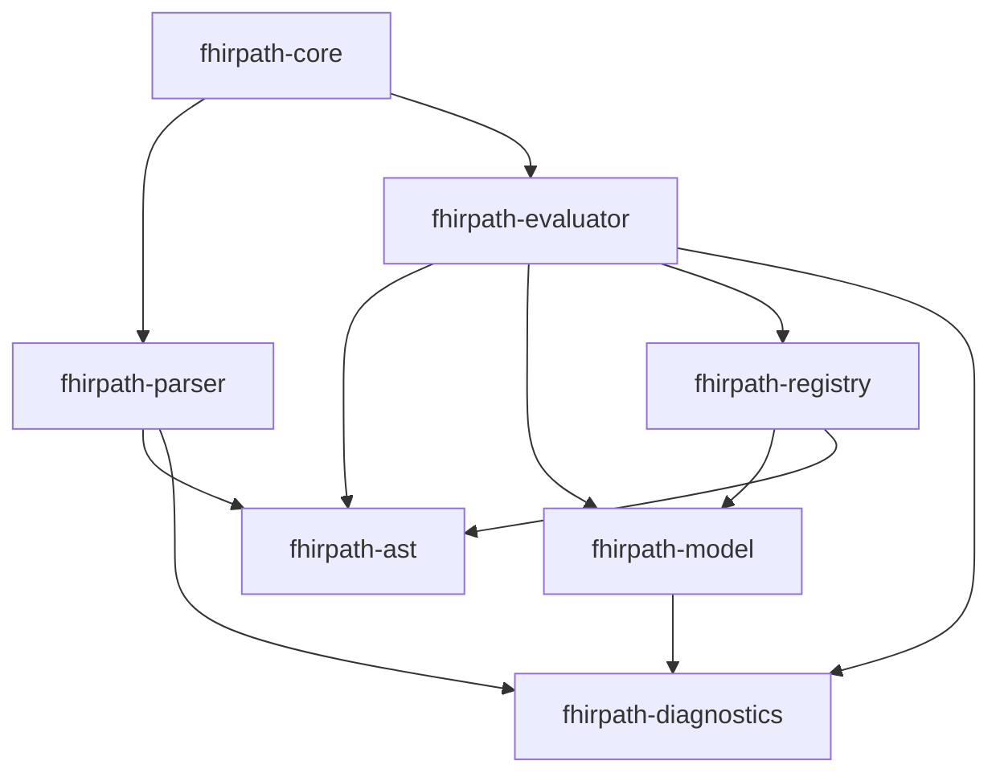

# ADR-002: Modular Architecture and Phased Implementation

## Status
Proposed

## Context
The FHIRPath implementation is complex and encompasses multiple concerns:
- Parsing expressions
- Managing data models across FHIR versions
- Function/operator registries
- Expression evaluation
- Diagnostics and error reporting
- Performance optimizations

A monolithic design would lead to:
- Long compilation times during development
- Tight coupling between components
- Difficulty in testing individual parts
- Poor separation of concerns

## Decision

### Crate Structure

We will split the implementation into multiple focused crates:

```
fhirpath-rs/
├── fhirpath-ast/          # AST definitions and visitors
├── fhirpath-model/        # Data model and FHIR Schema integration
├── fhirpath-parser/       # Parser implementation
├── fhirpath-registry/     # Function and operator registry
├── fhirpath-diagnostics/  # Diagnostic system
├── fhirpath-evaluator/    # Expression evaluation engine
├── fhirpath-core/         # Main integration crate
└── fhirpath-wasm/         # WASM bindings (existing)
```

### Implementation Phases

#### Phase 1: Foundation (Weeks 1-2)
1. **fhirpath-ast** crate
   - Core AST definitions
   - Visitor traits
   - AST utilities
   
2. **fhirpath-model** crate
   - FhirPathValue type
   - FHIR resource wrapper
   - Basic type system

#### Phase 2: Parsing (Weeks 3-4)
1. **fhirpath-parser** crate
   - Nom-based parser
   - Expression parsing
   - Basic error recovery
   
2. **fhirpath-diagnostics** crate
   - Diagnostic types
   - Error formatting
   - Source location tracking

#### Phase 3: Registry System (Weeks 5-6)
1. **fhirpath-registry** crate
   - Function trait and registry
   - Operator trait and registry
   - Built-in functions (basic set)
   - Built-in operators

#### Phase 4: Evaluation (Weeks 7-8)
1. **fhirpath-evaluator** crate
   - Basic evaluation engine
   - Context management
   - Integration with registry
   
2. **fhirpath-core** updates
   - Wire all components together
   - Public API design
   - Integration tests

#### Phase 5: FHIR Schema Integration (Weeks 9-10)
1. **fhirpath-model** enhancements
   - FHIR Schema loading
   - Type resolution
   - Multi-version support
   - Model provider trait

#### Phase 6: Advanced Features (Weeks 11-12)
1. Complete built-in function library
2. Advanced diagnostics with suggestions
3. Performance optimizations
4. Lazy evaluation support

#### Phase 7: Testing & Documentation (Weeks 13-14)
1. Comprehensive test suite
2. Benchmarking infrastructure
3. Documentation and examples
4. Integration with atomic-ehr tests

### Crate Dependencies



### Workspace Configuration

```toml
# Workspace Cargo.toml
[workspace]
members = [
    "fhirpath-ast",
    "fhirpath-model", 
    "fhirpath-parser",
    "fhirpath-registry",
    "fhirpath-diagnostics",
    "fhirpath-evaluator",
    "fhirpath-core",
    "fhirpath-wasm",
    "fhirpath-comparison",
]

[workspace.package]
version = "0.2.0"
edition = "2021"
authors = ["FHIRPath Contributors"]
license = "MIT OR Apache-2.0"
repository = "https://github.com/octofhir/fhirpath-rs"

[workspace.dependencies]
serde = { version = "1.0", features = ["derive"] }
serde_json = "1.0"
thiserror = "2.0"
anyhow = "1.0"
```

### Development Workflow Improvements

1. **Incremental Compilation**
   - Each crate compiles independently
   - Changes to evaluator don't trigger parser recompilation
   - Faster iteration cycles

2. **Parallel Testing**
   ```bash
   cargo test --workspace --jobs 8
   ```

3. **Feature Flags per Crate**
   ```toml
   # fhirpath-model/Cargo.toml
   [features]
   async-schema = ["tokio", "reqwest"]
   
   # fhirpath-diagnostics/Cargo.toml
   [features]
   lsp = ["lsp-types"]
   ```

4. **Development Scripts**
   ```bash
   # scripts/dev.sh
   #!/bin/bash
   # Watch and rebuild only affected crates
   cargo watch -x "check --workspace" -x "test -p $1"
   ```

## Consequences

### Positive
- **Faster build times**: 5-10x improvement in incremental builds
- **Better modularity**: Clear separation of concerns
- **Easier testing**: Unit test individual crates
- **Parallel development**: Teams can work on different crates
- **Cleaner APIs**: Each crate has focused public interface
- **Reusability**: Other projects can use individual crates

### Negative
- **Initial complexity**: More boilerplate for crate setup
- **Dependency management**: Need to manage inter-crate versions
- **Documentation overhead**: Each crate needs its own docs

### Migration Strategy

1. Start with new crate structure
2. Move existing code piece by piece
3. Maintain compatibility in fhirpath-core
4. Deprecate old module structure over time

## Implementation Guidelines

### Per-Crate Structure
```
fhirpath-xxx/
├── Cargo.toml
├── README.md
├── src/
│   ├── lib.rs
│   └── ...
├── tests/
│   └── integration_tests.rs
├── benches/
│   └── benchmarks.rs
└── examples/
    └── usage.rs
```

### Testing Strategy
- Unit tests in each crate
- Integration tests in fhirpath-core
- Property-based tests where applicable
- Benchmark critical paths

### Documentation Requirements
- Each crate must have comprehensive rustdoc
- README with usage examples
- Architectural decisions documented
- Performance characteristics noted